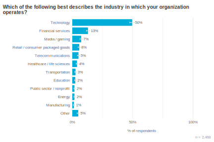

# Включить Скринкаст

---

# Заполнить на портале контакты

---

# Отметиться на лекции

(мы очень хотим увидеть ваши отзывы о лекциях)

---

# Преподаватели

### Сулаев Антон

###### Руководитель направления разработки API

### Киселев Андрей

###### Разработчик кросс-командных решений для бекенда Почты

### Немшилов Иван

###### Руководитель команды разработки бекенда Почты

  

  

### Лабзунова Дарья

###### Разработчик команды бекенда Авито

  

---

# Организационное. Общее

- Это факультатив. Ходить на него - ваше решение
- Можно не делать домашку, если она вам не нравится
- Можно вообще не делать домашки
- Если вы делаете домашку - вы делаете её сами и не обсуждаете решение с другими
- За списывание отчисляем с курса
- Если вы дали кому-то списать, то баллы за дз аннулируются

---

# Организационное. Формат взаимодействия

- Лучше не тянуть с домашкой. Ближе к дедлайну время проверки вырастает
- Менторы и преподаватели - люди работящие и не всегда сразу же отвечают
- Вопрос по теме лекции лучше сначала задать ментору, а потом уже преподавателю
- В общем чате нельзя делиться кодом и обсуждать детали конкретного решения домашки

---

# Статистика за прошлый семестр

| |N|%|
|-|-|-|
|заявок было на курс|547||
|зачислили|107|100%|
|закончили курс с отметкой 3+|19|17.7%|
|позвали на собесы|12|11.2%|
|попали на работу в вк|5|4.6%|

---

# Почему golang?

---

## Где больше всего используется golang

(<https://go.dev/blog/survey2023-h2-results>)

---

## Для чего больше всего используется golang

(<https://go.dev/blog/survey2023-h2-results>)

---

# Кто использует в VK

- Почта
- Облако
- Реклама
- ICQ
- Юла
- Медиапроекты
- Процессинг
- vkontakte
- Внутренняя разработка

---

# Кто использует в России

- VK
- Avito
- Ozon
- Tinkoff
- Сбермаркет
- Wildberries
- 2GIS
- МТС
- Acronis
- Get

- Positive Technologies
- ITooLabs
- Izvestia
- iSpring
- mc² software
- PostmanQ
- ThetaPad
- Tochka
- TRY.FIT

---

# Краткая история golang

## Разрабатывался ветеранами индустрии

- Кен Томпсон (UNIX, UTF-8, C)
- Роб Пайк (UTF-8, Plan 9, Inferno)
- Роберт Гризмер (Java HotSpot, Sawzall, распределённые системы Google)

## В условиях большой компании

- Много кода
- Много программистов
- Много серверов (а на них много ядер)
- Есть легаси код

---

# Про сервера и ядра

(<https://github.com/karlrupp/microprocessor-trend-data>)

---
<!-- https://www.quora.com/Scala-vs-Go-Could-people-help-compare-contrast-these-on-relative-merits-demerits -->
# Реалии разработки

- Меньше кода - проще для понимания, но есть грань
- Код читается чаще чем пишется
- Код часто живёт дольше, чем мы предполагаем
- Человек, который тестирует или поддерживает код, чаще всего не его первоначальный автор
- Средний уровень разработчика, который читает, пишет, поддерживает или тестирует код - “не эксперт”

---

# Что предлагает Golang

- Простой и компактный синтаксис (25 ключевых слов)
  - в C++ - 60 слов
  - в pyhon - 36 слов
- Мало магии и синтаксического сахара
  - Все касты типов вручную
  - Нет даже тернарного оператора
- Ориентация на простоту и читабельность кода
- Жесткий стиль кода и инструмент для авто-форматирования
- Множество синтаксических анализаторов

---

# Что предлагает Golang

- Быстрая компиляция
  - API почты собирается за 3 минуты (1.7млн строк кода)
  - Микросервисы собираются за 1 минуту
- Тесты из коробки
  - Вместе с покрытием и отчётом
  - Вместе с бенчмарками
- Профилировщик из коробки

---

# Что предлагает Golang

- Статический бинарь. Весь код в одном файле
  - Нет dependency hell
- Удобная работа с зависимостями
  - Просто кладём их в репозиторий
  - Просто скачиваем их с git
- Кросс-компиляция
  - Могу на своем макбуке скомпилить .exe

---

# Много ядер в процессоре

- Асинхронный i/o на уровне языка, а не либы
  - Нет callback-hell
  - Весь код стандартной библиотеки и внешних либ тоже!

- Приложение масштабируется на все ядра процессора

---

# 10 кубиков программиста

<table >
Обычно:
<tr>
    <td bgcolor="#cfe2f3">язык</td>
    <td bgcolor="#cfe2f3">язык</td>
    <td bgcolor="#cfe2f3">язык</td>
    <td bgcolor="#fff2cc">магия</td>
    <td bgcolor="#fff2cc">рантайм</td>
    <td bgcolor="#fff2cc">стиль</td>
    <td bgcolor="#fff2cc">отладка</td>
    <td bgcolor="#d9ead3">задача</td>
    <td bgcolor="#d9ead3">задача</td>
    <td bgcolor="#d9ead3">задача</td>
</tr>
</table>

 

- Бизнесу не нужно самовыражение программиста и его игры в песочнице.
- Бизнесу нужен продукт
- На go скучно заниматься чем-то кроме продукта

<table>
В golang:
<tr>
    <td bgcolor="#cfe2f3">язык</td>
    <td bgcolor="#cfe2f3">язык</td>
    <td bgcolor="#cfe2f3">язык</td>
    <td bgcolor="#fff2cc">магия</td>
    <td bgcolor="#d9ead3">задача</td>
    <td bgcolor="#d9ead3">задача</td>
    <td bgcolor="#d9ead3">задача</td>
    <td bgcolor="#d9ead3">задача</td>
    <td bgcolor="#d9ead3">задача</td>
    <td bgcolor="#d9ead3">задача</td>
</tr>
</table>
